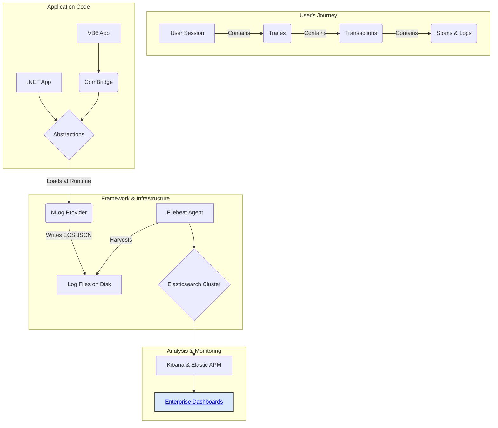

# Overview: The Modern Logging Framework

## 1. The Problem: A Black Box in Production

Our legacy application ecosystem, composed of both .NET modules and legacy VB6 modules, has historically been a "black box" in production. When issues arise in our Citrix environment, our support teams and developers struggle with:
-   **Lack of Insight:** Inconsistent, unstructured text-based logs make it nearly impossible to search for specific events or correlate actions across different parts of the system.
-   **Diagnosing User-Specific Issues:** It's incredibly difficult to isolate the actions of a single user in our multi-user Citrix environment.
-   **Reactive Troubleshooting:** We often only learn about problems after a user reports a crash, with little to no diagnostic information about what led to the failure.

## 2. The Goal: Achieving Observability

This logging framework was created to solve these problems by introducing modern observability practices to our entire application stack. The primary goal is to **transform our logs from simple text files into rich, structured, and searchable data streams.**

### Conceptual Goals:
-   **Unified Logging:** A single, consistent way to log from any application, whether it's VB6 or .NET.
-   **Structured Data:** Every log event is a structured JSON document, not just a line of text. This means we can filter, aggregate, and build dashboards on any piece of data in the log (e.g., `user.id`, `error.type`, `vb_error.number`).
-   **End-to-End Correlation:** Seamlessly connect a user's action from the first button click in the UI through every database call and business rule, even if it spans multiple applications.
-   **Resilience and Performance:** The logging system must be fast, efficient, and absolutely must not crash the application it's supposed to be monitoring.

## 3. The Solution at a Glance

We have built a highly decoupled logging framework that provides a simple API for developers and a powerful, structured data stream for ingestion into our Elasticsearch cluster. This allows us to trace a user's entire journey, from their session start to a single button click.



---

# Architectural Deep Dive

## 1. Guiding Principles

The framework's architecture was guided by three core principles:
1.  **Loose Coupling:** The application code must never have a direct dependency on a specific logging library (like NLog). This allows us to swap the provider in the future without changing any application code.
2.  **Resilience:** The logging framework must be more stable than the application it monitors. A failure to log must never result in an application crash.
3.  **Clear Separation of Concerns:** Each component should have one job and do it well.

## 2. Component Architecture

The solution is composed of a core `MyCompany.Logging` project that contains the abstractions and the COM bridge, and a separate `MyCompany.Logging.NLogProvider` project.

```mermaid
graph LR
    subgraph "Consumer Layer (VB6)"
        A[VB6 App]
    end
    subgraph "Consumer Layer (.NET)"
        C[.NET App] --> D[MyCompany.Logging (Abstractions)]
    end
    
    A -->|Calls| B[MyCompany.Logging (COM Bridge)]
    B -.->|Crosses COM/Interop Boundary| D
    
    subgraph "Core Framework"
        D -- "ILogger, ITracer, LogManager" --> E{Provider-Agnostic Contract}
    end

    subgraph "Implementation Layer"
       F[MyCompany.Logging.NLogProvider] -- "Implements Contracts" --> E
    end

    style F fill:#e1bee7,stroke:#333,color:#000
```

-   **`MyCompany.Logging.Abstractions`**: This namespace within the core project is the lightweight, central contract. It contains only interfaces (`ILogger`, `ITracer`) and the static `LogManager`. It has **zero dependencies** on NLog or any other third-party library.
-   **`MyCompany.Logging.NLogProvider`**: This is the concrete implementation. It references the `Abstractions` and contains all the NLog-specific code. It is responsible for all data enrichment.
-   **`MyCompany.Logging.Interop`**: This namespace within the core project is the dedicated adapter for our VB6 clients. It is COM-visible and provides a simple, intuitive API for VB6 developers.

## 3. Understanding Correlation: Session, Trace, Transaction, and Span

The most powerful feature of this framework is its ability to correlate events. We use a hierarchy of IDs to tell a complete story, from an entire user session down to a single database call.

### **`session.id` (The User Journey)**
This is the broadest context. A unique ID is generated automatically the *very first time* the logging framework is initialized within a process.
-   **Scope:** The entire lifetime of the application's parent process.
-   **Inheritance:** This ID is stored in a machine-wide environment variable. Crucially, any **child processes** (other EXEs) launched by your application will automatically inherit this ID.
-   **Purpose:** To answer the question, "Show me every single The primary goal is to **transform our logs from simple text files into rich, structured, and searchable data streams.**

### Conceptual Goals:
-   **Unified Logging:** A single, consistent way to log from any application, whether it's VB6 or .NET.
-   **Structured Data:** Every log event is a structured JSON document, not just a line of text. This means we can filter, aggregate, and build dashboards on any piece of data in the log (e.g., `user.id`, `error.type`, `vb_error.number`).
-   **End-to-End Correlation:** Seamlessly connect a user's action from the first button click in the UI through every database call and business rule, even if it spans multiple applications.
-   **Resilience and Performance:** The logging system must be fast, efficient, and absolutely must not crash the application it's supposed to be monitoring.

## 3. The Solution at a Glance

We have built a highly decoupled logging framework that provides a simple API for developers and a powerful, structured data stream for ingestion into our Elasticsearch cluster. This allows us to trace a user's entire journey, from their session start to a single button click.


---

# Logging Patterns: Simple vs. Scoped Logging

The framework supports two fundamental logging patterns. Understanding when to use each is key to creating effective and easy-to-analyze diagnostics.

### Pattern 1: Simple Logging (Event-Based)
This is for logging individual, standalone events. It's the equivalent of a traditional log message, but automatically enriched with structure and a `session.id`.

-   **Purpose:** To answer the question, **"What happened at a specific moment in time?"**
-   **Context:** Contains `session.id` but lacks `trace.id` and `transaction.id`.
-   **APM Visibility:** These logs appear in Kibana Discover/Logs but are **not** attached to a transaction waterfall in the APM UI.
-   **When to Use:**
    -   Application startup and shutdown events (`Application starting...`, `Configuration loaded.`).
    -   Periodic background tasks (`Cache cleanup started at 2:00 AM.`).
    -   Informational events that are not part of a specific user-driven operation.

### Pattern 2: Scoped Logging (Trace-Based)
This is for grouping all events related to a single, complete operation. This pattern is what populates the APM UI and provides the most powerful correlation.

-   **Purpose:** To answer the question, **"What is the complete story of why the 'Save Customer' action was slow or failed?"**
-   **Context:** Contains `session.id`, `trace.id`, `transaction.id`, and potentially `span.id`.
-   **APM Visibility:** Logs are automatically linked to their corresponding transaction in the APM UI's waterfall view.
-   **When to Use:**
    -   **Any user-initiated action:** This is the primary use case. Button clicks, menu selections, form submissions.
    -   **Any incoming request to a service:** e.g., a web API endpoint call.
    -   **Complex, multi-step business processes.**

| Feature | Simple Logging (Event) | Scoped Logging (Trace) |
| :--- | :--- | :--- |
| **Answers** | "What happened right now?" | "What is the story of this operation?" |
| **Correlation** | `session.id` only | `session.id` + `trace.id` + `transaction.id` |
| **APM UI** | Not visible in transaction view | **Visible** in transaction view |
| **Use For** | Standalone system events | User-driven or business operations |

---

# Architectural Deep Dive

## 1. Guiding Principles & Components
The framework's architecture was guided by three core principles: Loose Coupling, Resilience, and Separation of Concerns. It is composed of a core `MyCompany.Logging` project (Abstractions and COM Interop) and an implementation project `MyCompany.Logging.NLogProvider`.

```mermaid
graph LR
    subgraph "Consumer Layer (VB6)"
        A[VB6 App]
    end
    subgraph "Consumer Layer (.NET)"
        C[.NET App] --> D[MyCompany.Logging (Abstractions)]
    end
    
    A -->|Calls| B[MyCompany.Logging (COM Bridge)]
    B -.->|Crosses COM/Interop Boundary| D
    
    subgraph "Core Framework"
        D -- "ILogger, ITracer, LogManager" --> E{Provider-Agnostic Contract}
    end

    subgraph "Implementation Layer"
       F[MyCompany.Logging.NLogProvider] -- "Implements Contracts" --> E
    end

    style F fill:#e1bee7,stroke:#333,color:#000
```

## 2. The Concept of Scopes: Trace, Transaction, and Span
A **logging scope** groups all messages from a single operation into an understandable story.

-   **Trace:** The entire, end-to-end operation. The "umbrella" for everything.
-   **Transaction:** The main, high-level phase of work. In a client app, the first transaction *is* the trace. In a distributed system, each service call within a trace gets its own new transaction.
-   **Span:** A specific, timed sub-operation within a transaction, like a database call.

## 3. The Decoupling Mechanism & "Ambient Context"
The framework uses `Assembly.Load()` to load the NLog provider at runtime, ensuring loose coupling. For VB6, it provides an "ambient context backpack" via a `ThreadStatic` stack in the COM Bridge. This automatically enriches log calls with the active `trace.id` when developers use the `BeginTrace`/`BeginSpan` methods, removing the need to pass context manually. thing this user did, in every application they ran, since they started their session."

### **`trace.id` (A Single Operation)**
This is the "umbrella" for everything that happens as a result of a single, top-level trigger, like a user clicking a button.
-   **Scope:** An entire, end-to-end operation.
-   **Analogy:** The entire story of "The User Saved a Customer".
-   **Purpose:** To answer the question, "Show me every log and performance metric related to the 'Save Customer' action, from start to finish." All events within the trace share this ID.

### **`transaction.id` (A Major Phase of Work)**
This represents a significant, high-level segment of work within a trace.
-   **Scope:** A major phase of an operation. In a simple client application, the first transaction *is* the trace.
-   **Analogy:** The main chapter of the story, e.g., "Processing the SaveCustomerClick Event in the VB6 App".
-   **Purpose:** To group all work done by a specific component or service. If a trace crosses process boundaries, each component will create its own transaction, but they will all share the same `trace.id`.

### **`span.id` (A Sub-Operation)**
This represents a specific, timed sub-operation within a transaction.
-   **Scope:** A smaller, specific piece of work, like a database call or a business rule calculation.
-   **Analogy:** A paragraph in a chapter, e.g., "Validated Customer Address".
-   **Purpose:** To measure the performance of individual pieces of work within a larger transaction.

## 4. The Decoupling Mechanism: Runtime Initialization

The key to the loose coupling is the static `LogManager.Initialize()` method. It uses internal configuration to find and load the provider assembly (e.g., "MyCompany.Logging.NLogProvider") at runtime via `Assembly.Load()`. This means the consuming application **never needs a compile-time reference** to the provider, allowing it to be swapped in the future.

## 5. The Ambient Context "Backpack" for VB6

For VB6, we built a robust "ambient context" system into the `ComBridge` using a thread-safe stack. When a developer calls `BeginTrace()` or `BeginSpan()`, a handle object is returned. When this handle is destroyed (`Set obj = Nothing`), its scope is automatically popped from the stack, ensuring all logs in between are correctly correlated.

---

# VB6 Logging: Usage and Examples

## 1. Setup (One-Time Project Configuration)

To enable modern logging in your VB6 project, you must perform the following **two mandatory steps**.

### Step 1: Add the Type Library Reference
Reference the Type Library (`.tlb`) file created by the .NET build process.
1.  In the VB6 IDE, go to **Project -> References...** and click the **Browse...** button.
2.  Change the file type dropdown to **Type Libraries (*.olb, *.tlb)**.
3.  Navigate to the build output folder (e.g., `bin\Debug`) and select **`MyCompany.Logging.tlb`**.
4.  Click **Open**, then **OK**.

### Step 2: Import the Global Logger Module
Import the shared `modLogging.bas` module from a central source control location.
1.  In the VB6 IDE, go to **Project -> Add Module** and choose the **Existing** tab.
2.  Navigate to the shared location (e.g., `\\TFS_Server\Common\VB6_Modules\`) and select **`modLogging.bas`**.

The contents of `modLogging.bas` should be:
```vb
' In modLogging.bas
Private g_Logger As MyCompanyLogging.LoggingComBridge

Public Sub InitializeLogging()
    If Not g_Logger Is Nothing Then Exit Sub
    Set g_Logger = New MyCompanyLogging.LoggingComBridge
End Sub

Public Function Logger() As MyCompanyLogging.LoggingComBridge
    If g_Logger Is Nothing Then InitializeLogging
    Set Logger = g_Logger
End Function
```

### Step 3: Initialize the Logger on Startup
Call `InitializeLogging` from your application's main entry point (e.g., `Sub Main` or the startup `Form_Load`).

```vb
Private Sub Form_Load()
    InitializeLogging
End Sub
```

## 2. Choosing Your Logging Pattern: Simple vs. Scoped (Traced)

The framework supports two distinct patterns. Choosing the right one is key to creating useful, understandable logs.

### Pattern 1: Simple Logging
This is a single, "fire-and-forget" log message.

```vb
' A simple log call
Logger.Info "frmMain", "Form_Load", "Application startup complete."
```

-   **When to Use:** Only for static, one-off events that are not part of a user workflow. Good examples include:
    -   Logging the application version at startup.
    -   Logging that the application is shutting down.
    -   Logging a loaded configuration value.
-   **What You Get:** The log is correlated by `session.id`.
-   **Limitation:** The log is **not** connected to any specific user action in the APM view. It's an isolated event.

### Pattern 2: Scoped (Traced) Logging (BEST PRACTICE)
This pattern wraps a unit of work inside a scope, correlating everything that happens within it.

```vb
' Create a logging scope
Dim trace As MyCompanyLogging.ILoggingTransaction
Set trace = Logger.BeginTrace("SaveCustomerClick", TxType_UserInteraction)

' All logs inside this scope are now correlated
Logger.Info "frmCustomer", "cmdSave_Click", "Save operation initiated."
' ... more code and logs ...

' End the scope
Set trace = Nothing
```

-   **When to Use:** For **any and all user-initiated actions or business processes**. This should be your default choice.
-   **What You Get:** Full correlation with `session.id`, `trace.id`, `transaction.id`, and `span.id`.
-   **Benefit:** Creates a complete, step-by-step story of an operation that appears in the APM UI, making troubleshooting incredibly fast and effective.

## 3. Detailed Example: Tracing a Unit of Work

Always use the `Logger()` function from `modLogging.bas` to get the logger object. This guarantees your code will not crash.

```vb
Public Sub cmdSave_Click()
    Dim trace As MyCompanyLogging.ILoggingTransaction
    On Error GoTo Handle_Error
    
    Set trace = Logger.BeginTrace("SaveCustomerClick", TxType_UserInteraction)
    
    Logger.Info "frmCustomer", "cmdSave_Click", "Save operation initiated."
    
    ' ... your business logic here ...

Cleanup:
    If Not trace Is Nothing Then Set trace = Nothing
    Exit Sub
    
Handle_Error:
    Logger.ErrorHandler "frmCustomer", "cmdSave_Click", _
                         "Failed to save customer.", _
                         Err.Description, Err.Number, Err.Source, Erl
    GoTo Cleanup
End Sub
```

---

# .NET Logging: Usage and Examples

## 1. Setup (One-Time Application Configuration)

### Step 1: Initialize the Framework
In your application's `Program.cs`, add a single line to initialize the framework.

```csharp
// In Program.cs
using MyCompany.Logging.Abstractions;
// ...
public static class Program
{
    [STAThread]
    static void Main()
    {
        LogManager.Initialize(AppRuntime.DotNet);
        // ...
    }
}
```

### Step 2: Getting a Logger Instance
In any class where you need to log, get a `private static readonly` logger instance.

```csharp
// At the top of your class file
using MyCompany.Logging.Abstractions;

public class MyService
{
    private static readonly ILogger _log = LogManager.GetCurrentClassLogger();
    // ...
}
```

## 2. Choosing Your Logging Pattern: Simple vs. Scoped (Traced)

The framework supports two distinct patterns. Choosing the right one is key to creating useful, understandable logs.

### Pattern 1: Simple Logging
This is a single, "fire-and-forget" log message.

```csharp
// A simple log call
_log.Info("Application startup complete.");
```

-   **When to Use:** Only for static, one-off events that are not part of a user workflow. Good examples include:
    -   Logging the application version at startup.
    -   Logging that the application is shutting down.
-   **What You Get:** The log is correlated by `session.id`.
-   **Limitation:** The log is

---

# VB6 Logging: Usage and Examples

## 1. Setup (One-Time Project Configuration)
To enable logging, you must perform the following **two mandatory steps**.

### Step 1: Add the Type Library Reference
1.  In the VB6 IDE, go to **Project -> References...**
2.  Click **Browse...**, change the file type to **Type Libraries (*.olb, *.tlb)**.
3.  Navigate to the build output folder (e.g., `bin\Debug`) and select **`MyCompany.Logging.tlb`**.
4.  Click **Open**, then **OK**.

### Step 2: Import the Global Logger Module
1.  In the VB6 IDE, go to **Project -> Add Module** and choose the **Existing** tab.
2.  Navigate to the central shared code location and select **`modLogging.bas`**. Click **Open**.

The contents of `modLogging.bas`:
```vb
' In modLogging.bas
Private g_Logger As MyCompanyLogging.LoggingComBridge

Public Sub InitializeLogging()
    If Not g_Logger Is Nothing Then Exit Sub
    Set g_Logger = New MyCompanyLogging.LoggingComBridge
End Sub

Public Function Logger() As MyCompanyLogging.LoggingComBridge
    If g_Logger Is Nothing Then
        InitializeLogging
    End If
    Set Logger = g_Logger
End Function
```

### Step 3: Initialize the Logger on Startup
Call `InitializeLogging` from your application's main entry point (e.g., `Sub Main` or `Form_Load`).

```vb
' In your application's startup Sub
Private Sub Form_Load()
    InitializeLogging
    ' This is a "Simple Log" - it has a session.id but no trace.
    Logger.Info "frmMain", "Form_Load", "Application startup complete."
End Sub
```

## 2. Usage Examples

### Tracing a Unit of Work (Scoped Logging)
This is the **best practice** for any significant user action.

```vb
Public Sub cmdSave_Click()
    Dim trace As MyCompanyLogging.ILoggingTransaction
    On Error GoTo Handle_Error
    
    ' Start a SCOPE for this entire operation.
    Set trace = Logger.BeginTrace("SaveCustomerClick", TxType_UserInteraction)
    
    ' This log is now part of the trace.
    Logger.Info "frmCustomer", "cmdSave_Click", "Save operation initiated."
    
    ' ... your business logic here ...

Cleanup:
    If Not trace Is Nothing Then Set trace = Nothing
    Exit Sub
    
Handle_Error:
    Logger.ErrorHandler "frmCustomer", "cmdSave_Click", "Failed to save customer.", _
                         Err.Description, Err.Number, Err.Source, Erl
    GoTo Cleanup
End Sub
```

---

# .NET Logging: Usage and Examples

## 1. Setup (One-Time Application Configuration)

### Step 1: Initialize the Framework
In `Program.cs`, add the initialization call.
```csharp
// In Program.cs
using MyCompany.Logging.Abstractions;
// ...
static class Program
{
    [STAThread]
    static void Main()
    {
        LogManager.Initialize(AppRuntime.DotNet);
        // ...
    }
}
```

### Step 2: Getting a Logger Instance
In any class, create a `private static readonly` field for the logger.
```csharp
// At the top of your class file
using MyCompany.Logging.Abstractions;

public class MyService
{
    private static readonly ILogger _log = LogManager.GetCurrentClassLogger();
    // ...
}
```

## 2. Usage Examples

### Tracing a Unit of Work (Scoped Logging) - BEST PRACTICE

```csharp
using MyCompany.Logging.Abstractions;
using System;

public class OrderProcessor
{
    private static readonly ILogger _log = LogManager.GetCurrentClassLogger();
    
    public void FulfillOrder(int orderId)
    {
        // Use the framework's tracer to create a SCOPE for this operation.
        LogManager.Tracer.Trace("FulfillOrder", TxType.Process, () =>
        {
            // All logs inside this lambda are automatically part of the trace.
            _log.Info("Fulfilling order {OrderId}", orderId);
            
            LogManager.Tracer.Trace("NotifyShippingDept", TxType.Process, () =>
            {
                _log.Debug("Calling shipping department API for order {OrderId}", orderId);
            });
            
            _log.Info("Order {OrderId} fulfillment complete.", orderId);
        });
    }
}
```

### Advanced: Bridging VB6 and .NET Scopes
This framework excels at creating a single, unified trace when a VB6 app calls a .NET component.

1.  **VB6 Initiates the Trace:** The VB6 `cmd_Click` event calls `Logger.BeginTrace`.
2.  **.NET Continues the Trace:** The .NET component it calls then uses `LogManager.Tracer.Trace`. The framework automatically detects the existing trace from VB6 and creates a *new transaction* within it, perfectly stitching the two parts of the operation together in the APM UI.

---

# Post-Deployment Configuration & Analysis

## 1. Adjusting Log Levels with `nlog.config`
Logging verbosity is controlled by `nlog.config`. This file can be edited manually on a server for quick diagnostics, or managed centrally and deployed to the fleet via tools like Octopus Deploy. Because `autoReload="true"` is set, NLog will pick up changes without an application restart.

```xml
<rules>
  <!-- TEMPORARY DIAGNOSTIC RULE -->
  <logger name="LegacyApp.exe.frmOrders.frm.*" minlevel="Trace" writeTo="app-log-file" final="true">
    <filters>
      <when condition="equals('${windows-identity:domain=false}', 'jdoe', ignoreCase=true)" action="Log" />
    </filters>
  </logger>
  
  <!-- DEFAULT PRODUCTION RULE -->
  <logger name="*" minlevel="Info" writeTo="app-log-file" />
</rules>
```

## 2. Analyzing Logs in Kibana and Elastic

**[Link to Enterprise Logging Dashboards](https://my-elastic-instance/kibana/app/dashboards)**

### Common Search Queries (KQL) in Kibana

-   **See a user's entire session:** `session.id: "a8c3e0b1f2d44e5f8a7b6c5d4e3f2a1b"`
-   **See a single traced operation:** `trace.id: "e4a9c8b7f6d5e4f3a2b1c0d9e8f7a6b5"`
-   **Find all VB6 errors:** `log.level: error and labels.app_type: "VB6"`
-   **Find a specific VB6 runtime error:** `vb_error.number: 76`

### Using the APM UI
For any operation wrapped in a trace (`BeginTrace` or `Tracer.Trace`), you can use the APM UI in Kibana to see the transaction waterfall view. All correlated logs will appear automatically at the bottom of the trace view, providing a direct link from performance metrics to application logs.