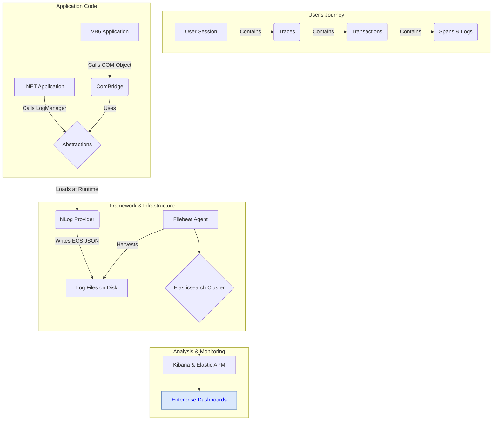
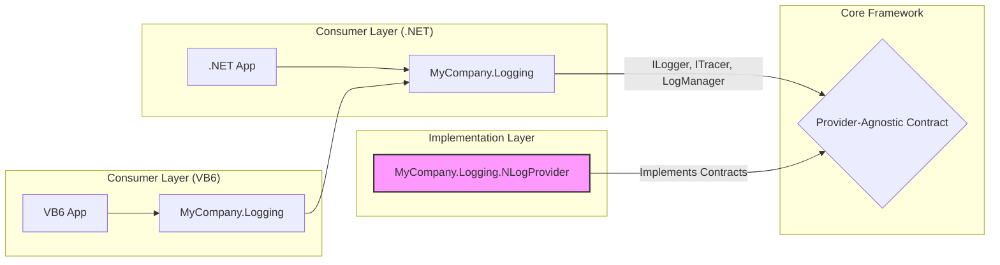

# Overview: The Modern Logging Framework

## 1. The Problem: A Black Box in Production

Our legacy application ecosystem, composed of both modern .NET services and critical VB6 applications, has historically been a "black box" in production. When issues arise in our Citrix environment, our support teams and developers struggle with:
-   **Lack of Insight:** Inconsistent, unstructured text-based logs make it nearly impossible to search for specific events or correlate actions across different parts of the system.
-   **Diagnosing User-Specific Issues:** It's incredibly difficult to isolate the actions of a single user in our multi-user Citrix environment.
-   **Reactive Troubleshooting:** We often only learn about problems after a user reports a crash, with little to no diagnostic information about what led to the failure.

## 2. The Goal: Achieving Observability

This logging framework was created to solve these problems by introducing modern observability practices to our entire application stack. The primary goal is to **transform our logs from simple text files into rich, structured, and searchable data streams.**

### Conceptual Goals:
-   **Unified Logging:** A single, consistent way to log from any application, whether it's VB6 or .NET.
-   **Structured Data:** Every log event is a structured JSON document, not just a line of text. This means we can filter, aggregate, and build dashboards on any piece of data in the log (e.g., `user.id`, `error.type`, `vb_error.number`).
-   **End-to-End Correlation:** Seamlessly connect a user's action from the first button click in the UI through every database call and business rule, even if it spans multiple applications.
-   **Resilience and Performance:** The logging system must be fast, efficient, and absolutely must not crash the application it's supposed to be monitoring.

## 3. The Solution at a Glance

We have built a highly decoupled logging framework that provides a simple API for developers and a powerful, structured data stream for ingestion into our Elasticsearch cluster. This allows us to trace a user's entire journey, from their session start to a single button click.



---

# Architectural Deep Dive

## 1. Guiding Principles

The framework's architecture was guided by three core principles:
1.  **Loose Coupling:** The application code must never have a direct dependency on a specific logging library (like NLog). This allows us to swap the provider in the future without changing any application code.
2.  **Resilience:** The logging framework must be more stable than the application it monitors. A failure to log must never result in an application crash.
3.  **Clear Separation of Concerns:** Each component should have one job and do it well.

## 2. Component Architecture

The solution is composed of a core `MyCompany.Logging` project that contains the abstractions and the COM bridge, and a separate `MyCompany.Logging.NLogProvider` project.



-   **`MyCompany.Logging.Abstractions`**: This namespace within the core project is the lightweight, central contract. It contains only interfaces (`ILogger`, `ITracer`) and the static `LogManager`. It has **zero dependencies** on NLog or any other third-party library.
-   **`MyCompany.Logging.NLogProvider`**: This is the concrete implementation. It references the `Abstractions` and contains all the NLog-specific code. It is responsible for all data enrichment.
-   **`MyCompany.Logging.Interop`**: This namespace within the core project is the dedicated adapter for our VB6 clients. It is COM-visible and provides a simple, intuitive API for VB6 developers.

## 3. The Decoupling Mechanism: Runtime Initialization

The key to the loose coupling is the static `LogManager.Initialize()` method.
-   An application (e.g., a WinForms `Program.cs` or the `ComBridge` constructor) calls the simple `LogManager.Initialize(AppRuntime.DotNet)`.
-   The `LogManager` uses internal configuration to find the provider assembly name (e.g., "MyCompany.Logging.NLogProvider").
-   It then uses **`Assembly.Load()`** to load the provider DLL at runtime and reflection to find and instantiate the provider's factory and tracer classes.
-   This means the consuming application **never needs a compile-time reference** to `MyCompany.Logging.NLogProvider`, allowing the provider to be swapped out in the future by changing the internal configuration in `LogManager`.

## 4. Developer Concerns: The Ambient Context "Backpack"

For VB6, which lacks modern context-propagation features, we built a robust "ambient context" system into the `ComBridge`.

-   **The Problem:** Manually passing a properties dictionary through every function call is tedious and error-prone.
-   **The Solution:** The `ComBridge` exposes `BeginTrace()` and `BeginSpan()` methods. When called, they return a "handle" object (`ILoggingTransaction`). Behind the scenes, the bridge pushes a new scope onto a thread-safe stack.
-   **Automatic Enrichment:** Any log call made while that scope is active will be **automatically enriched** with the correct `trace.id`, `transaction.id`, and `span.id` from the active scope.
-   **Guaranteed Cleanup:** The "handle" object implements `IDisposable`. When the VB6 developer sets the handle variable to `Nothing`, the COM Interop layer guarantees that the `.Dispose()` method on the .NET object is called, which safely pops the scope from the stack. The bridge is also resilient to out-of-order disposal to prevent context corruption.

---

# VB6 Logging: Usage and Examples

## 1. Setup (One-Time Project Configuration)

Before you can use the logger, you must add it to your VB6 project and initialize it once when your application starts.

### Step 1: Add the COM Reference
The `MyCompany.Logging.dll` must be registered on your development machine using `regasm.exe`. Once registered, add the reference to your project:
1.  In the VB6 IDE, go to **Project -> References...**
2.  Find and check the box for **"MyCompany Logging Framework"**.
3.  Click OK.

### Step 2: Create a Global Logger Module
It is best practice to create a single, global logger object that your entire application can share.

1.  Create a new Module (`.bas` file) in your project, for example `modLogging.bas`.
2.  Add the following code to the module:

```vb
' In modLogging.bas

' 1. Declare a public logger object that can be accessed globally.
Public g_Logger As MyCompanyLogging.LoggingComBridge

' 2. Create a public sub to initialize the logger.
Public Sub InitializeLogging()
    ' This creates the one and only logger instance for the application.
    Set g_Logger = New MyCompanyLogging.LoggingComBridge
End Sub
```

### Step 3: Initialize the Logger on Startup
Call the `InitializeLogging` sub from your application's main entry point. This is typically `Sub Main` or the `Form_Load` event of your startup form.

```vb
' In your application's startup Sub or Form
Private Sub Form_Load()
    ' Initialize the logger once when the application starts.
    InitializeLogging
    
    ' Now you can use g_Logger anywhere in your application.
    g_Logger.Info "frmMain", "Form_Load", "Application startup complete."
End Sub
```

You only need to do this once. The `g_Logger` object is lightweight and can be safely reused throughout your entire application.

## 2. How Correlation IDs Work

Our framework automatically adds several correlation IDs to your logs.

-   **`session.id` (The User Journey):** A unique ID is generated automatically the *very first time* the logging framework is initialized within a process. This ID is then stored in a machine-wide environment variable. Crucially, any **child processes** (other EXEs) launched by your application will automatically inherit this environment variable and therefore share the same `session.id`. This links the entire user journey together, even across multiple applications, for the lifetime of the initial parent process.
-   **`trace.id` & `transaction.id` (A Single Operation):** When you want to group all logs related to a single user action (like clicking a button), you use the `BeginTrace` method.
-   **`span.id` (A Sub-Operation):** Within a trace, you can use `BeginSpan` to measure and group logs for a smaller piece of work.

## 3. Usage and Examples

### Tracing a Unit of Work (The "Backpack") - BEST PRACTICE

This is the **recommended pattern** for any significant user action. It creates a full trace, allowing you to see all related logs together in Kibana. You should use the `TxType` enum constants provided by the framework.

**Rule:** The object returned by `BeginTrace` or `BeginSpan` **MUST** be set to `Nothing` when the operation is complete to clean up the context. Always use the `On Error GoTo...Cleanup` pattern to guarantee this.

```vb
Public Sub cmdSave_Click()
    Dim trace As MyCompanyLogging.ILoggingTransaction
    Dim dbSpan As MyCompanyLogging.ILoggingTransaction
    
    On Error GoTo Handle_Error
    
    ' 1. START THE TRACE: Use the TxType enum for the transaction type.
    ' (e.g., TxType_UserInteraction, TxType_Process)
    Set trace = g_Logger.BeginTrace("SaveCustomerClick", TxType_UserInteraction)

    ' This log now has session, trace, and transaction IDs.
    g_Logger.Info "frmCustomer", "cmdSave_Click", "Save operation initiated by user."
    
    ' 2. START A SPAN: Measure a specific sub-operation.
    Set dbSpan = g_Logger.BeginSpan("SaveToDatabase", TxType_DataSearch)
    
        ' This log has session, trace, transaction, AND span IDs.
        g_Logger.Debug "frmCustomer", "cmdSave_Click", "Executing UPDATE statement."
        
    ' 3. END THE SPAN
    Set dbSpan = Nothing
    
    g_Logger.Info "frmCustomer", "cmdSave_Click", "Database save complete."

' --- Cleanup Block: This runs on both success and error paths ---
Cleanup:
    ' Safely end scopes in reverse order of creation.
    If Not dbSpan Is Nothing Then Set dbSpan = Nothing
    If Not trace Is Nothing Then Set trace = Nothing
    Exit Sub

' --- Error Handling Block ---
Handle_Error:
    ' The active trace/span context is added automatically to this error log!
    g_Logger.ErrorHandler "frmCustomer", "cmdSave_Click", _
                         "An unexpected database error occurred during save.", _
                         Err.Description, Err.Number, Err.Source, Erl
    ' After logging, jump to the cleanup block to ensure context is released.
    GoTo Cleanup
End Sub
```

---

# .NET Logging - Usage and Examples

## 1. Setup (One-Time Application Configuration)

### Step 1: Initialize the Framework
In your application's main entry point (typically `Program.cs` for Console/WinForms or `Global.asax.cs` for web apps), add a single line to initialize the logging framework.

```csharp
// In Program.cs or equivalent startup file
using MyCompany.Logging.Abstractions;
using System;
using System.Windows.Forms;

static class Program
{
    [STAThread]
    static void Main()
    {
        // Initialize the logger once when the application starts.
        LogManager.Initialize(AppRuntime.DotNet);

        Application.EnableVisualStyles();
        Application.SetCompatibleTextRenderingDefault(false);
        Application.Run(new Form1());
    }
}
```

### Step 2: Getting a Logger Instance
In any class where you need to log, get a logger instance. The best practice is to create a `private static readonly` field. This is highly efficient and the logger object is safe for reuse.

```csharp
// At the top of your class file
using MyCompany.Logging.Abstractions;

public class MyService
{
    // Get a logger instance once per class.
    private static readonly ILogger _log = LogManager.GetCurrentClassLogger();
    
    // ... now you can use _log in all methods of this class ...
}
```

## 2. How Correlation IDs Work

-   **`session.id` (The User Journey):** A unique ID is generated automatically the *very first time* the logging framework is initialized. This ID is then stored in an environment variable for the lifetime of the process. Crucially, any **child processes** launched by your application will automatically inherit this ID, allowing you to trace a user's entire workflow across multiple executables.
-   **`trace.id`, `transaction.id`, `span.id` (Tracing):** In .NET, these are managed by our framework's `ITracer` interface. You simply wrap your code in a `LogManager.Tracer.Trace` call, and the framework handles creating the transaction and correlating all logs within that scope.

## 3. Usage and Examples

### Tracing a Unit of Work - BEST PRACTICE
This is the standard, provider-agnostic pattern for tracing an operation in .NET.

```csharp
using MyCompany.Logging.Abstractions;
using System;

public class OrderProcessor
{
    private static readonly ILogger _log = LogManager.GetCurrentClassLogger();
    
    public void FulfillOrder(int orderId)
    {
        // Use the framework's tracer to capture this method as a single transaction.
        // This creates the trace.id and transaction.id. All logs inside the lambda
        // will be automatically correlated.
        LogManager.Tracer.Trace("FulfillOrder", TxType.Process, () =>
        {
            // This log will automatically have session, trace, and transaction IDs.
            _log.Info("Fulfilling order {OrderId}", orderId);
            
            // To create a child span, you simply nest another Trace call.
            // The framework handles the parent/child relationship automatically.
            LogManager.Tracer.Trace("NotifyShippingDept", TxType.Process, () =>
            {
                // This log will have session, trace, transaction, AND span IDs.
                _log.Debug("Calling shipping department API for order {OrderId}", orderId);
            });
            
            _log.Info("Order {OrderId} fulfillment complete.", orderId);
        });
    }

    public void HandleError()
    {
        try
        {
            throw new InvalidOperationException("Could not connect to warehouse inventory.");
        }
        catch (Exception ex)
        {
            // If this code is running inside a LogManager.Tracer.Trace scope,
            // this error log will be automatically correlated with it.
            _log.Error(ex, "An error occurred while handling inventory.");
        }
    }
}
```

---

# Post-Deployment Configuration & Analysis

## 1. Adjusting Log Levels with `nlog.config`
The logging verbosity is controlled by the `<rules>` section in the `nlog.config` file, which is deployed alongside your application. This file can be edited on a server **without recompiling or redeploying the application**. Because `autoReload="true"` is set, NLog will automatically pick up the changes within a few seconds.

### Default Configuration
The default rule logs `Info` level and above for all loggers.
```xml
<rules>
  <!-- DEFAULT PRODUCTION RULE -->
  <logger name="*" minlevel="Info" writeTo="app-log-file" />
</rules>
```

### How to Enable Debug Logging for a Specific Area
To troubleshoot an issue, you can add a more specific rule **above** the default rule. The `final="true"` attribute is critical to prevent duplicate logging.

**Scenario:** We need to enable `Trace` level logging for user `jdoe` but only when they are using the `frmOrders.frm` screen in `LegacyApp.exe`.

1.  Open `nlog.config` on the server.
2.  Add the following `<logger>` block inside the `<rules>` section, **before** the default rule.

```xml
<rules>
  <!-- 
    TEMPORARY DIAGNOSTIC RULE:
    This rule enables TRACE logging only for user 'jdoe' when the logger name
    starts with 'LegacyApp.exe.frmOrders.frm'.
  -->
  <logger name="LegacyApp.exe.frmOrders.frm.*" minlevel="Trace" writeTo="app-log-file" final="true">
    <filters>
      <when condition="equals('${windows-identity:domain=false}', 'jdoe', ignoreCase=true)" action="Log" />
    </filters>
  </logger>
  
  <!-- DEFAULT PRODUCTION RULE -->
  <logger name="*" minlevel="Info" writeTo="app-log-file" />
</rules>
```

3.  Save the file. The new logging level will take effect almost immediately. Once you are done troubleshooting, simply remove the temporary rule block and save the file again.

## 2. Analyzing Logs in Kibana and Elastic

All logs are enriched with correlation IDs, allowing for powerful analysis.

**[Link to Enterprise Logging Dashboards](https://my-elastic-instance/kibana/app/dashboards)**

### Common Search Queries (KQL) in Kibana

-   **See a user's entire session from start to finish:**
    `session.id: "a8c3e0b1f2d44e5f8a7b6c5d4e3f2a1b"`

-   **See everything related to one specific operation (VB6 or .NET):**
    `trace.id: "e4a9c8b7f6d5e4f3a2b1c0d9e8f7a6b5"`

-   **Find all errors from VB6 applications:**
    `log.level: error and labels.app_type: "VB6"`

-   **Find a specific VB6 runtime error number:**
    `vb_error.number: 76`

-   **Find all logs from a specific .NET service:**
    `service.name: "MyCompany.PaymentService.exe"`

### Using the APM UI in Kibana

For operations traced with our framework's `LogManager.Tracer` or the VB6 `BeginTrace` method, you can use the APM UI:
1.  Navigate to the **APM** section in Kibana.
2.  Find your service (`MyCompany.PaymentService.exe` or `LegacyApp.exe`).
3.  Click on a transaction (e.g., "FulfillOrder" or "SaveCustomerClick") to see the **transaction waterfall view**.
4.  This view shows you the timing of all spans. At the bottom, there is a section for **"Logs"** which will show only the log messages correlated with that specific transaction. This is the fastest way to go from a performance problem to the logs that explain it.