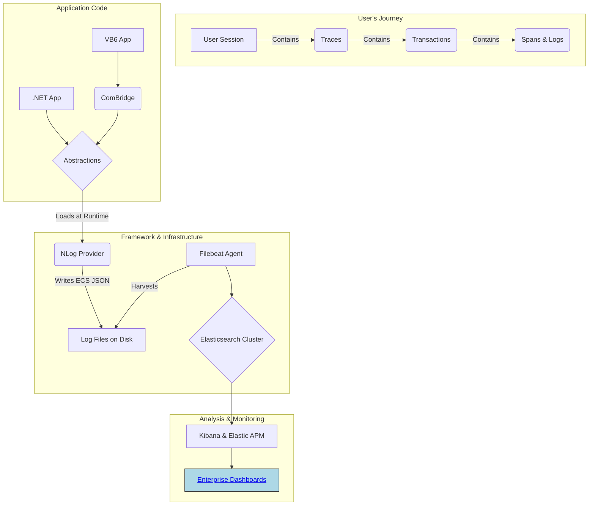
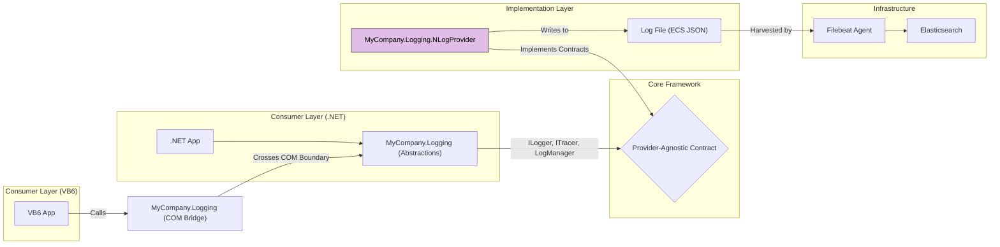

# Overview: The Modern Logging Framework

## 1. The Problem: A Black Box in Production

Our legacy application ecosystem, composed of both .NET and VB6 modules, has historically been a "black box" in production. When issues arise in our Citrix environment, our support teams and developers struggle with:
-   **Lack of Insight:** Inconsistent, unstructured text-based logs make it nearly impossible to search for specific events or correlate actions across different parts of the system.
-   **Diagnosing User-Specific Issues:** It's incredibly difficult to isolate the actions of a single user in our multi-user Citrix environment.
-   **Reactive Troubleshooting:** We often only learn about problems after a user reports a crash, with little to no diagnostic information about what led to the failure.

## 2. The Goal: Achieving Observability

This logging framework was created to solve these problems by introducing modern observability practices to our entire application stack. The primary goal is to **transform our logs from simple text files into rich, structured, and searchable data streams.**

### Conceptual Goals:
-   **Unified Logging:** A single, consistent way to log from any application, whether it's VB6 or .NET.
-   **Structured Data:** Every log event is a structured JSON document, not just a line of text.
-   **End-to-End Correlation:** Seamlessly connect a user's action from the first button click in the UI through every database call and business rule.
-   **Resilience and Performance:** The logging system must be fast, efficient, and absolutely must not crash the application it's supposed to be monitoring.

## 3. The Solution at a Glance

We have built a highly decoupled logging framework that provides a simple API for developers and a powerful, structured data stream for ingestion into our Elasticsearch cluster.



---

# Logging Patterns: Simple vs. Scoped Logging

The framework supports two fundamental logging patterns. Understanding when to use each is key to creating effective and easy-to-analyze diagnostics.

### Pattern 1: Simple Logging (Event-Based)
This is for logging individual, standalone events. It's the equivalent of a traditional log message, but automatically enriched with structure and a `session.id`.

-   **Purpose:** To answer the question, **"What happened at a specific moment in time?"**
-   **Context:** Contains `session.id` but lacks `trace.id` and `transaction.id`.
-   **APM Visibility:** These logs appear in Kibana Discover/Logs but are **not** attached to a transaction waterfall in the APM UI.
-   **When to Use:**
    -   Application startup and shutdown events (`Application starting...`, `Configuration loaded.`).
    -   Periodic background tasks (`Cache cleanup started at 2:00 AM.`).
    -   Informational events that are not part of a specific user-driven operation.

### Pattern 2: Scoped Logging (Trace-Based)
This is for grouping all events related to a single, complete operation. This pattern is what populates the APM UI and provides the most powerful correlation.

-   **Purpose:** To answer the question, **"What is the complete story of why the 'Save Customer' action was slow or failed?"**
-   **Context:** Contains `session.id`, `trace.id`, `transaction.id`, and potentially `span.id`.
-   **APM Visibility:** Logs are automatically linked to their corresponding transaction in the APM UI's waterfall view.
-   **When to Use:**
    -   **Any user-initiated action:** This is the primary use case. Button clicks, menu selections, form submissions.
    -   **Any incoming request to a service:** e.g., a web API endpoint call.
    -   **Complex, multi-step business processes.**

| Feature | Simple Logging (Event) | Scoped Logging (Trace) |
| :--- | :--- | :--- |
| **Answers** | "What happened right now?" | "What is the story of this operation?" |
| **Correlation** | `session.id` only | `session.id` + `trace.id` + `transaction.id` |
| **APM UI** | Not visible in transaction view | **Visible** in transaction view |
| **Use For** | Standalone system events | User-driven or business operations |

---

# Architectural Deep Dive

## 1. Guiding Principles & Components
The framework's architecture was guided by three core principles: Loose Coupling, Resilience, and Separation of Concerns.



## 2. Correlation IDs: Session, Trace, Transaction, and Span
The framework uses a hierarchy of IDs to tell a complete story.

-   **`session.id` (The User Journey):** A unique ID generated automatically the *very first time* the logging framework is initialized. It is inherited by any child processes, allowing you to trace a user's entire workflow across multiple executables for the lifetime of the parent process.
-   **`trace.id` (The End-to-End Operation):** The "umbrella" ID for everything that happens as a result of a single, top-level trigger. All events in a trace share this ID.
-   **`transaction.id` (A Major Phase of Work):** Groups all work done by a specific component. In a client app, the first transaction ID is the same as the trace ID. In a distributed system, each service call within a trace gets its own new transaction ID, but shares the parent's trace ID.
-   **`span.id` (A Sub-Operation):** A specific, timed sub-operation within a transaction, like a database call.

## 3. Decoupling and Initialization
The key to the loose coupling is the static `LogManager.Initialize()` method. It uses internal configuration to find and load the provider assembly (e.g., "MyCompany.Logging.NLogProvider") at runtime via `Assembly.Load()`. This means the consuming application **never needs a compile-time reference** to the provider, allowing it to be swapped in the future.

For VB6, the framework also provides an "ambient context backpack" via a `ThreadStatic` stack in the COM Bridge. This automatically enriches log calls with the active `trace.id` when developers use the `BeginTrace`/`BeginSpan` methods, removing the need to pass context manually.

---

# VB6 Logging: Usage and Examples

## 1. Setup (One-Time Project Configuration)
To enable logging, you must perform the following **two mandatory steps**. Forgetting either step will result in a compile-time error, which is by design.

### Step 1: Add the Type Library Reference
The .NET build process automatically registers the COM components. As a developer, you simply need to reference the generated Type Library (`.tlb`) file.
1.  In the VB6 IDE, go to **Project -> References...**
2.  Click the **Browse...** button.
3.  In the file dialog, change the file type dropdown to **Type Libraries (*.olb, *.tlb)**.
4.  Navigate to the folder where `MyCompany.Logging.dll` was built (e.g., `bin\Debug`) and select **`MyCompany.Logging.tlb`**.
5.  Click **Open**, then **OK**.

### Step 2: Import the Global Logger Module
The framework relies on a shared code module to provide safe access to the logger. It is critical that you **import this module from a central, shared location** in source control.
1.  In the VB6 IDE, go to **Project -> Add Module** and choose the **Existing** tab.
2.  Navigate to the central shared code location (e.g., `\\TFS_Server\Common\VB6_Modules\`) and select **`modLogging.bas`**. Click **Open**.

The contents of `modLogging.bas`:
```vb
' In modLogging.bas
Private g_Logger As MyCompanyLogging.LoggingComBridge

Public Sub InitializeLogging()
    If Not g_Logger Is Nothing Then Exit Sub
    Set g_Logger = New MyCompanyLogging.LoggingComBridge
End Sub

Public Function Logger() As MyCompanyLogging.LoggingComBridge
    If g_Logger Is Nothing Then InitializeLogging
    Set Logger = g_Logger
End Function
```

### Step 3: Initialize the Logger on Startup
Call `InitializeLogging` from your application's main entry point (e.g., `Sub Main` or the startup `Form_Load`).
```vb
Private Sub Form_Load()
    InitializeLogging
    ' This is an example of a "Simple Log" - it has a session.id but no trace.
    Logger.Info "frmMain", "Form_Load", "Application startup complete."
End Sub
```

## 2. Example: Tracing a Unit of Work
This is the **best practice** for any significant user action. Always use the `Logger()` function to guarantee your code will not crash.
```vb
Public Sub cmdSave_Click()
    Dim trace As MyCompanyLogging.ILoggingTransaction
    On Error GoTo Handle_Error
    
    ' Start a SCOPE for this entire operation using the safe accessor function.
    Set trace = Logger.BeginTrace("SaveCustomerClick", TxType_UserInteraction)
    
    ' This log is now part of the trace.
    Logger.Info "frmCustomer", "cmdSave_Click", "Save operation initiated."
    
    ' ... your business logic here ...

Cleanup:
    If Not trace Is Nothing Then Set trace = Nothing
    Exit Sub
    
Handle_Error:
    Logger.ErrorHandler "frmCustomer", "cmdSave_Click", "Failed to save customer.", _
                         Err.Description, Err.Number, Err.Source, Erl
    GoTo Cleanup
End Sub
```

---

# .NET Logging: Usage and Examples

## 1. Setup (One-Time Application Configuration)

### Step 1: Initialize the Framework
In `Program.cs`, add the initialization call.
```csharp
// In Program.cs
using MyCompany.Logging.Abstractions;
// ...
static class Program
{
    [STAThread]
    static void Main()
    {
        LogManager.Initialize(AppRuntime.DotNet);
        // ...
    }
}
```

### Step 2: Getting a Logger Instance
In any class, create a `private static readonly` field for the logger.
```csharp
// At the top of your class file
using MyCompany.Logging.Abstractions;

public class MyService
{
    private static readonly ILogger _log = LogManager.GetCurrentClassLogger();
    // ...
}
```

## 2. Example: Tracing a Unit of Work
This is the **best practice** for tracing an operation in .NET.
```csharp
using MyCompany.Logging.Abstractions;
using System;

public class OrderProcessor
{
    private static readonly ILogger _log = LogManager.GetCurrentClassLogger();
    
    public void FulfillOrder(int orderId)
    {
        // Use the framework's tracer to create a SCOPE for this operation.
        LogManager.Tracer.Trace("FulfillOrder", TxType.Process, () =>
        {
            // All logs inside this lambda are automatically part of the trace.
            _log.Info("Fulfilling order {OrderId}", orderId);
            
            // Nesting a trace call creates a child span.
            LogManager.Tracer.Trace("NotifyShippingDept", TxType.Process, () =>
            {
                _log.Debug("Calling shipping department API for order {OrderId}", orderId);
            });
            
            _log.Info("Order {OrderId} fulfillment complete.", orderId);
        });
    }
}
```

## 3. Advanced Use Case: Bridging VB6 and .NET
This framework excels at creating a single, unified trace when a VB6 app calls a .NET component.

1.  **VB6 Initiates the Trace:** The VB6 `cmd_Click` event calls `Logger.BeginTrace`. This starts the overall trace and creates the first transaction.
2.  **.NET Continues the Trace:** The .NET component it calls then uses `LogManager.Tracer.Trace`. The framework automatically detects the existing trace started by VB6 and creates a *new transaction* within it, perfectly stitching the two parts of the operation together in the APM UI.

---

# Post-Deployment Configuration & Analysis

## 1. Adjusting Log Levels with `nlog.config`
Logging verbosity is controlled by the `nlog.config` file, which is deployed alongside your application. This file can be edited manually on a server for quick diagnostics, or managed centrally and deployed to the fleet (or a subset) via tools like Octopus Deploy runbooks. Because `autoReload="true"` is set, NLog will pick up changes without an application restart.

The `nlog.config` file in source control contains the full template: **[Link to nlog.config in Source Control]**

### Key Configuration Sections
The `<variables>` section is used to define the log directory. The `<targets>` section defines *where* to write logs, and uses the `${ecs-layout}` to format them as structured JSON.
```xml
<nlog>
  <variable name="logDirectory" value="C:\Logs\MyApplication" />
  
  <targets>
    <target name="app-log-file" xsi:type="File"
            fileName="${logDirectory}\app.log"
            archiveEvery="Day"
            archiveNumbering="Rolling"
            maxArchiveFiles="7">
      <layout xsi:type="JsonLayout" includeAllProperties="true">
        <attribute name="time" layout="${longdate}" />
        <!-- ECS Standard Fields -->
        <attribute name="log.level" layout="${level:upperCase=true}" />
        <attribute name="message" layout="${message}" />
        <!-- Add more attributes as needed -->
      </layout>
    </target>
  </targets>
  
  <rules>
    <logger name="*" minlevel="Info" writeTo="app-log-file" />
  </rules>
</nlog>
```

### Example: Enabling Debug Logging for a Specific User
```xml
<rules>
  <!-- TEMPORARY DIAGNOSTIC RULE -->
  <logger name="LegacyApp.exe.frmOrders.frm.*" minlevel="Trace" writeTo="app-log-file" final="true">
    <filters>
      <when condition="equals('${windows-identity:domain=false}', 'jdoe', ignoreCase=true)" action="Log" />
    </filters>
  </logger>
  
  <!-- DEFAULT PRODUCTION RULE -->
  <logger name="*" minlevel="Info" writeTo="app-log-file" />
</rules>
```

## 2. Analyzing Logs in Kibana and Elastic

### Common Search Queries (KQL)
-   **See a user's entire session:**
    `session.id: "a8c3e0b1f2d44e5f8a7b6c5d4e3f2a1b"`
-   **See a single traced operation:**
    `trace.id: "e4a9c8b7f6d5e4f3a2b1c0d9e8f7a6b5"`
-   **Find all errors from VB6 apps:**
    `log.level: error and labels.app_type: "VB6"`
-   **Find errors that are NOT from a specific source:**
    `log.level: error and not vb_error.source: "DAO.Engine"`
-   **Find all logs from any of our Order Processing modules:**
    `service.name: *Order*`
-   **Find slow database calls:**
    `transaction.type: "db.sql" and transaction.duration.us > 500000`

### Using the APM UI
For any operation wrapped in a trace (`BeginTrace` or `Tracer.Trace`), you can use the APM UI in Kibana to see a transaction waterfall view.
-   The `TxType` enum you provide (e.g., `TxType.UserInteraction`, `TxType.DataSearch`) directly maps to the `transaction.type` field in APM, which is used to group and aggregate transactions on the main dashboards.
-   All correlated logs appear automatically at the bottom of the trace view, providing a direct link from performance metrics to application logs.